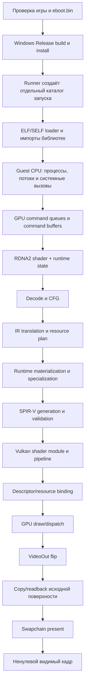

# Ghost of Yōtei в KytyPS5 на Windows: прогресс и план запуска

## Пересборка после rebase: 25 сентября 2026

**Native Windows build: FAIL. CPU resource regression: FAIL. GPU regression,
новый rendered frame, menu и gameplay на этой ревизии: PENDING.**

Проверена ветка после rebase `9185f41`, содержащая `upstream/main` `5a705dd`.
Входные незакоммиченные resource changes сохранены в `4ac718a`, ограниченная
попытка согласования интерфейсов — в `84efac8`. Исходники замораживались на
каждую native сборку; сборки выполнялись последовательно через
`_Build/windows-local.cmd`, clang-cl/Ninja/Release, launcher включён.

Первая команда `build` обнаружила выключенный launcher в старом CMake cache;
`configure` с launcher ON устранил только эту проблему окружения. Повторная
сборка выявила несовместимый resource/texture code. После частичного исправления
`integration-inventory` (`launcher kyty_tests --parallel 16 -- -k 0`) завершился
FAIL: 289 уникальных diagnostics в 29 файлах, сгруппированных по shared causes
в `docs/open-pr-usefulness-review.md`. Error limit означает, что список не
гарантированно исчерпывающий. Бинарник эмулятора этой ревизии не получен.

Собранный `resource_tracking_tests.exe` дал самостоятельный CPU RED:
`compute buffer fill: fill proof accepted an unsafe store or missed the real GTA3 clear`.
Это новый текущий blocker; старые результаты 46/51 ниже не являются результатами
данной ревизии. Отдельный `save_data_memory_tests` построен и выполнен: PASS.

Артефакты: `_Build/merge-validation-20260925/initial-worktree.patch`,
`initial-reconfigure-build.stdout.log`, `integration-build-1.stdout.log`,
`integration-build-2.stdout.log`, `integration-inventory.stdout.log`,
`unique-errors.txt`, `error-summary.txt`, `resource-tracking-first.stderr.log`,
`save-data-build.stdout.log`, `save-data-test-independent.stdout.log`.
Для каждой native команды runner сохраняет stdout, stderr и JSON exit status;
лимит build — 1800 секунд, CPU test — 45/60 секунд. GPU и игра не запускались.

Полезные независимые изменения #812 и test-aggregate commit из #798 перенесены
в `wip/yotei-upstream-20260925`. Старая опубликованная ветка не переписывается
force-push. Следующее обязательное действие — восстановить согласованность
shader/renderer interfaces и получить GREEN существующих регрессий либо
продолжить от предыдущего проверенного checkpoint с выборочной интеграцией.

## Исторические результаты до rebase


Обновлено **9 сентября 2026 года**. Игра: **Ghost of Yōtei, PPSA26344**.
Рабочая ветка — `yotei-windows-bringup` в локальном fork `fxpw/KytyPS5`.

Checkpoint синхронизации **9 сентября 2026, 15:55 UTC**: merge-коммит
`a309653` включает `upstream/main` до `0b4e78c` и устраняет конфликты PR #497
без title/hash branching. Помимо upstream DB render-override copy, CES, APR и
shader ISA изменений, интеграция добавила недостающую поддержку live-return
`DS_INC_RTN_U32`/`DS_DEC_RTN_U32` для cooperative wave64 LDS/GDS. Неизменённый
upstream selector `--ds-atomics-only` сначала дал RED на
`SharedAtomicInc32`, затем полностью GREEN; `--context-state-only`, три
SAVEEXEC wave cases, `kernel_file_system_tests` и
`resource_materialization_tests` также GREEN. Native Windows build завершён,
локальный эквивалент Windows CI — **3/3 PASS**. Полный расширенный CTest —
**46/51 PASS**: пять ранее существующих веточных долгов перечислены в
`docs/emulator-test-debt.md`; этот merge не объявляет нового игрового кадра.

Текущий rendered-frame checkpoint **9 сентября 2026, 10:10–10:18 UTC**
впервые доказал ненулевой source RGB на `96611fe` (RTX 5060 Ti). Bounded
GPUAV-lite run `_Build/runs/yotei-integrated-20260909-101008-669804` с
`ShaderOptimizationType=None` достиг `shown=280`. Readback
`_Build/analysis/yotei-present-none-96611fe-20260909.txt` остаётся нулевым до
source frame 235, затем фиксирует анимированный белый loading spinner:
frame 236 имеет `colored=10`, frame 242 — `colored=214`, а максимум RGB доходит
до `658/670/658`. Screenshot
`_Build/analysis/yotei-first-nonzero-96611fe.png` визуально подтверждает spinner
в правом верхнем углу. Критерий **первого ненулевого кадра выполнен**; меню и
gameplay остаются **PENDING**.

Перед этим checkpoint `96611fe` добавил regression-first объединение
последовательных read-only LDS accesses в одну cooperative scheduler phase.
Неизменённый synthetic сначала дал RED
`consecutive read-only LDS accesses created an unnecessary cooperative rendezvous`,
затем GREEN; `read -> write -> read` сохраняет две hazard-границы. Соседние
cooperative CPU selectors и четыре Vulkan compute tests GREEN. Точный
`54904fb419d79e49` уменьшился с 702 611 до 697 920 SPIR-V слов, но 60-секундный
watchdog остановил run на `VkCreateComputePipelinesBegin`: этого уменьшения пока
недостаточно для bounded driver compile.

Performance A/B показал, почему холодный запуск выглядит как очень низкий FPS:
на предыдущем run 269 SPIR-V optimizer calls заняли суммарно 241 с (до 8,7 с
на permutation), тогда как traced `vkCreateComputePipelines` для обычных модулей
завершался быстро. Режим `None` дошёл до первого spinner примерно за 77 с, но
для огромного cooperative module переложил стоимость в NVIDIA pipeline compiler.
Следующий шаг — regression-first factoring повторяющихся software wave64
collectives в общие SPIR-V functions, затем повторный bounded run с watchdog
60 с. Отключение Vulkan/GPUAV validation остаётся небезопасным из-за
воспроизводимого `0x80000003` около guest frame 13.

Текущий performance/runtime checkpoint **8 сентября 2026, 20:04–20:12 UTC**
проверил `f1776f0` на RTX 5060 Ti. Общая CFG-правка ограничивает semantic
shared-tail cloning размером локального региона, а не размером всего shader.
Exact `6cc64dee32dc7094` больше не падает в dispatcher fallback: structured CFG
имеет 376 blocks, а полный audit этого manifest сократился примерно с 13,02 до
3,45 с. Полный corpus `_Build/shader-audits/yotei-local-region-clone-20260908`
дал **743/825 passed, 82 failed за 37,851 с** против 741/825 за 57,019 с; новых
status regressions нет. Synthetic selector `--shared-merge-cfg-only`, exact
manifest и патологический соседний manifest GREEN/bounded.

Холодный GPUAV-lite run
`_Build/runs/yotei-integrated-20260908-200400-74722b` завершился сам за 145 с
на frame 133 / 119 shown вместо 1123 с у сопоставимого диагностического run:
время до нового фронтира улучшилось примерно в **7,7 раза**. Кратковременно до
тяжёлого участка наблюдалось около 2,73 FPS против прежних 0,062 FPS. Новый
decoder fatal — compute shader `c8e8f554efbfadef`, MUBUF opcode `0x87`, raw
`[0xe21c6000 0x8002000e]`, PC `0xc6c`. Прогретый GPUAV-lite run
`_Build/runs/yotei-integrated-20260908-201027-d8c982` завершился сам за 120 с на
frame 130 / 117 shown; 118 source readbacks 480x270 имеют `colored=0`, RGB=0 и
alpha=3. Первый ненулевой кадр остаётся **PENDING**.

Отключение GPUAV пока не является безопасным fast path. Два bounded запуска без
GPUAV на frame 12/13 воспроизвели одинаковый Windows APPCRASH внутри
`nvgpucomp64.dll` 32.0.16.1664 с exception `0x80000003`; это не emulator fatal.
GPUAV и non-GPUAV driver cache сохранены отдельными файлами, смешивать их нельзя
до отдельной cache-identity/driver regression. Для следующих correctness
итераций остаётся GPUAV-lite с прогретым cache: дорогой 15-минутный stall уже
устранён, а следующий обязательный шаг — RED/общая реализация MUBUF `0x87` и
повторный source readback, а не ожидание дополнительных кадров.

Текущий runtime checkpoint **8 сентября 2026, 17:19–17:50 UTC** проверил
`672af1f` на RTX 5060 Ti с GPU-assisted validation lite и source readback.
Процесс завершился сам, не по таймауту: exit code `321`, frame 222, 193 GPU
flips, 192 shown. Все 192 readback 480×270 имеют RGB=0 и alpha=3, поэтому
первый ненулевой кадр остаётся **PENDING**. При этом прежний
`34e090c623ad611c` materialization blocker пройден, тяжёлый dispatcher
`6cc64dee32dc7094` выпустил 359 238 SPIR-V слов, а driver cache был сохранён
размером 18 031 187 байт. Новый первый fatal находится раньше CFG следующего
compute shader `c8e8f554efbfadef`: compact VOPC opcode `0xbd`, raw
`0x7d7a40ff`, PC `0xf4`.

Checkpoint `5aaf3b4` реализует общий GFX10 `V_CMPX_NE_U16`: decoder читает
literal/operands, направляет compare mask в EXEC, lowering выполняет unsigned
16-bit `not equal`, SPIR-V проходит validator. Окончательный неизменённый
synthetic test сначала дал RED `decoder rejected captured VOPC
V_CMPX_NE_U16 fields`, затем GREEN `KYTY_VOPC_CMPX_NE_U16_PASS`. Полный
CPU-аудит `_Build/shader-audits/yotei-current-20260908-vopc-bd/report.json`
дал **741/825 passed, 84 failed** против прежних 714/825: исчезли обе группы
`0xbd` — 19 compact и 7 SDWA manifests. Bounded game-проверка `5aaf3b4`
остаётся следующим действием; этот synthetic/corpus результат сам по себе не
объявляется первым кадром.

Текущий цикл **8 сентября 2026, 14:21–15:14 UTC** выборочно перенёс доказанный
подкласс heterogeneous indirect images из PR #383. Synthetic RED воспроизвёл
таблицу, где sampled candidates совпадают по numeric/mip/conversion/cube/compare,
но имеют dimensions 2D и 1D. В `22242aa` materialization допускает только этот
безопасный подкласс, а `ImageRead`/`ImageSampleRaw` строят координаты и image type
для каждого candidate отдельно; несовпадающие numeric class и неподдержанные
query/gather остаются fail-closed. Неизменённые resource и SPIR-V тесты GREEN.

Установленный emulator SHA-256:
`1c4a3d2dc6a80c5896f2849774cdb6dc9e1d49e1b14275ed5d550488392bed50`.
Bounded GPUAV run `_Build/runs/yotei-integrated-20260908-150356-e59dec` с окном
320×180 достиг frame 132 / 120 GPU flips / 119 shown и прошёл прежний PC `0x7c4`.
Новый первый fatal — indirect image table PC `0x78b8`: candidates отличаются
dimension 2D/1D и shader swizzle `0x24c/0`. Source readback frames 110–119 всё ещё
RGB=0, alpha=3. Первый ненулевой RGB остаётся **PENDING**.

Текущий цикл **8 сентября 2026, 13:26–14:06 UTC** исправил точный dispatcher
variant compute shader `6cc64dee32dc7094`. Прежний run до frame 179 не
компилировал этот variant, поэтому вывод о том, что `b247c0f` закрыл PC `0x656c`,
был неверным. Новый synthetic RED воспроизвёл signed runtime loop со stride 196,
дополнительным mask guard и четырьмя correlated scalar-buffer descriptor words.
Общий signed-loop proof уже существовал, но был отключён для dispatcher. В
`90fed2b` dispatcher строит полный CFG и допускается в тот же строгий proof;
неизменённый тест и exact manifest проходят resource tracking.

Установленный emulator SHA-256:
`ee33baac73ada2a5c29686a1bdbdec842c64f58276e67bd692441df06682c269`.
Bounded GPUAV run `_Build/runs/yotei-integrated-20260908-140320-cf909d` достиг
frame 139 / 125 GPU flips / 124 shown и прошёл PC `0x656c`. Новый первый fatal —
`indirect image table at pc 0x000007c4 has incompatible candidates`; это точно
совпадает с классом heterogeneous indirect images из PR #383. В новом тихом run
source readback не записывался; последний доказанный результат остаётся 55 кадров
110–164 с RGB=0, alpha=3. Первый ненулевой RGB остаётся **PENDING**.

Цикл **8 сентября 2026, 08:31–09:30 UTC** выборочно перенёс общий механизм из
upstream PR #500: строгий recognizer полного DWORD pattern fill, сохранение точного
HTILE fill value и его guest-memory side effect, а также materialization
канонических `0`/`0xfffffff0` в native D32 при sampled-depth чтении. Синтетический
RED сначала остановился на `complete dword-pattern HTile fill was not recognized`,
а расширенный RED выявил stale raw metadata при повторном texture acquisition.
Неизменённый selector после исправления проходит три фазы, включая
`tracked-pattern-clear-one`; соседние array/admission/meta/subset selectors и тот
же тест с реально загруженным GPUAV layer также GREEN. Логи сохранены в
`_Build/logs/pattern-htile-20260908/`.

Затронутые translation units текущего дерева компилируются native Windows, но
полный target в исходном dirty tree отдельно остановлен незавершённым ballot
изменением: `spirvEmitterProgram.cpp` обращается к отсутствующему
`EmitterState::wave_ballot_word_variables`. Для bounded проверки был собран
отдельный test-only executable с временной нулевой декларацией; после сборки она
удалена, `spirvEmitterInternal.h` снова не отличается от исходного рабочего
дерева. Два run этого binary —
`yotei-pattern-htile-current-20260908-092819-bb437d` и прогретый
`yotei-pattern-htile-current-warm-20260908-092936-fda3a1` — воспроизвели прежний
driver breakpoint `0x80000003` при `b90e2024732c6111` до guest VideoOut. Поэтому
игровой nonzero-RGB критерий этим циклом **не проверен и остаётся PENDING**;
synthetic GREEN не объявляется первым кадром.

Последний цикл **7 сентября 2026, 21:11–21:14 UTC** добавил общий lowering
для доказанно инъективных split-wave64 LDS DWORD stores: адрес
`(LaneId << 2) + offset` при одной полной host workgroup теперь использует
обычный `OpStore`, а неопределённые/конфликтующие адреса сохраняют
`OpAtomicStore`. Synthetic RED/GREEN с прямым и EXEC-select адресом пройден,
а реальный RTX 5060 Ti run создал и выполнил прежние `b90e`/`a766` границы.
Installed emulator SHA-256:
`c3088432abe5babdbe573b8f651a74f11976129b9dbb0a639e8789d7a254570c`.

Предыдущий цикл **7 сентября 2026, 18:50 UTC** добавил общий lowering
zero-tested `BitwiseOr32` для split-wave64: когда integer OR имеет единственного
потребителя `IEqual32`/`INotEqual32` с нулём, emitter сохраняет точную семантику
через два integer compare и `OpLogicalAnd`/`OpLogicalOr`, не выпуская
compiler-sensitive integer OR над Workgroup-derived словами. Synthetic RED/GREEN,
`spirv-val` и изолированный Vulkan probe пройдены. Installed emulator SHA-256:
`69459c99af122d2dd14e751e2e77c73794e9556546b662e06b0d70b71e8ca64d`.
Fast-прогон `yotei-integrated-20260907-184839-3aecc7` дошёл до более поздних
frame-39 dispatches; старый диагностический GPUAV-прогон
`yotei-integrated-20260907-185013-3a240a` был остановлен на
`a7661ff4ea282325`, что устранено следующим LDS lowering. Ненулевой rendered
frame, меню и gameplay всё ещё **PENDING**.

**Последний диагностический запуск дошёл до frame 158, 146 GPU flips и 145 shown,
но первый ненулевой кадр, меню и управляемая сцена пока не подтверждены.**
Signed storage shader
`753c552fae650ec4` и packed-D16/descriptor shader `da7e70d9fcafe48c` теперь
выпускают SPIR-V и создают Vulkan pipelines. Зависимые bounded buffer/image/sampler
descriptors для `8457901d80b91921` теперь материализуются, а scalar-address branch
на guest PC 612 доказана wave-uniform. Guard-bounded inline table у
`f8927c09f4b928c7` теперь использует 255 допустимых selector values вместо
1 445 ложных wrap-кандидатов; shader выпустил 203 924 SPIR-V слова. Optional SRT
с null base в vertex shader `ee4f153aa500d327` теперь выпускает SPIR-V. Точный
byte-limit и cross-DWORD доступ устранили renderer blocker на R16 storage buffer с residual 6.
Активные fragment inputs теперь входят в static key парного vertex shader, а producer outputs
объявляются и collision-remap aliases записываются в точные host locations. Прежний VUID по
Location 2 пройден. Экспоненциальный обход общих descriptor-зависимостей устранён
memoization завершённых узлов, а восемь согласованных wave-uniform image DWORD у
`7ceb0f3417f926f9` теперь образуют конечную таблицу кандидатов. Shader проходит
resource tracking, выпускает 103 404 SPIR-V слова и создаёт pipeline. Прежний image
blocker также пройден: 256-байтный placed-view адрес больше не проверяется как
начало отдельной 4-КБ allocation. Проверочный readback первых восьми source
frames соседнего запуска 960×540 всё ещё показал нулевой RGB, поэтому первый
полезный кадр пока не доказан.

Прежняя граница с reset NVIDIA пройдена. На native subgroup32 graphics wave64
теперь использует конечную partitioned-модель: lane targets ограничиваются
локальной половиной, ballot согласован между двумя guest mask words, а pixel-loop
имеет общий бюджет 256 входов в тело. Захваченный PS `964747887d898821` выпускает
валидный SPIR-V, auto draw из четырёх вершин получает `after-complete`, и после
него завершились последующие draw/dispatch без нового System event `nvlddmkm`.
GFX10 byte-to-D16 opcodes `0x20...0x23` теперь декодируются как общая группа с
unsigned/signed расширением, выбором low/high half и сохранением соседней половины
VGPR. Compute shader `d7a83911714a58ee` выпустил SPIR-V и завершил dispatch.
В большом compute shader `6cc64dee32dc7094` теперь доказан конечный selector
0...31 и однозначный dispatcher entry prefix для buffer table с шагом 16;
прежний отказ на PC `0x530` пройден. Scalar-buffer image table с ключом
`ReadFirstLane(Phi) << 5` теперь проходит общий inline image-table путь, включая
`ImageRead`; текущая граница того же shader — отдельный `GetBufferResource` с root
`ReadConstBuffer` на guest PC `0x656c`.

Persistent Vulkan pipeline cache работает и переживает перезапуск. Новые driver
pipelines сохраняются каждые 16 созданий, поэтому принудительный timeout больше
не теряет весь прогрев; одинаковый payload повторно на диск не записывается. Cache убрал
примерно 60-секундную первую компиляцию самого тяжёлого pipeline, но не устранил
постоянное время GPU-исполнения. CFG-исправление снизило steady-время
`e52e19c6923301d0` примерно с 8,37 с до 14–16 мс; `916ea8893e5b276a`
по-прежнему занимает около 6,05 с. Phase-liveness снизил его оптимизированный
SPIR-V со 170 999 до 146 134 слов, `OpLoad` с 11 561 до 8 993 и `OpStore` с
3 408 до 1 410, но это не изменило GPU-время. Следующий уровень оптимизации —
структура программного cooperative wave64 scheduler. Изображение осталось чёрным.

Последующий readback/resource trace уточнил источник чёрного RGB. В capture
`yotei-integrated-20260907-231606-784e0c` `CS 79b9dff52896199d` читает
`0x5000920000` и записывает `0x50318b0000`; входной depth ресурс остаётся нулевым,
а `PS 63971eb3488c4486` поэтому оставляет `0x5000860000` с RGB=0
(формат A2R10G10B10, alpha=3). Все найденные draw states для
`z_write_base_addr=0x5000920000` имеют `z_enable=false` и `z_write_enable=false`;
подходящего clear или первого writer в capture не найдено. Это пока не доказывает
ошибку depth path: depth attachment нельзя включать принудительно и нельзя подменять
другим адресом без bounded RED-теста первого producer. Отдельный доказанный defect
RenderTarget→VideoOut aliasing — потеря DCC/compression metadata — исправляется
   shared merge в `textureCache.cpp`; новый readback уже показывает `compression=1`,
   но сам по себе этот fix не создаёт upstream цветные пиксели. Синтетический
   non-zero HTILE depth producer/readback теперь GREEN. Следующая обязательная
   граница — завершить соседний ballot build/runtime path, затем повторить тот же
   bounded game run и проверить source RGB без принудительного включения depth.

8 сентября добавлено исправление GPU sync diagnostics: `DrawIndex` и `DrawIndexAuto`
теперь трассируют любой непустой draw при валидной диагностике даже при заданных
`KYTY_GPU_SYNC_MIN_WORKGROUPS`/`KYTY_GPU_SYNC_GROUPS`; эти фильтры применяются только
к dispatch. RED/GREEN helper-тест пройден, а `graphicsRun.cpp` и compute-test harness
скомпилированы native Windows. Это исправляет диагностику, но не доказывает первый
ненулевой кадр: upstream `0x5000920000` по-прежнему требует отдельного producer-теста.

Этот документ — текущая сводка, а не первоначальный план от 5 сентября.
Ожидание загрузки файлов, первый запуск Windows-сборки и поиск начального
MIMG/DPP8 препятствия уже пройдены. Исторические результаты вынесены ниже;
они не заменяют последнюю проверку игры.

Текущий быстрый цикл аудита исправил общий случай buffer descriptor table,
где индекс образован unsigned bitfield extraction. Native Windows-сборка
`shader_cfg_tests` прошла, а `cs_00010f14` и `cs_000153d4` теперь доходят до
`compute_execution_precheck` в обеих конфигурациях барьеров. Из прежней группы
из семи shader Phi-барьер также снят для `cs_00016ff4`, `cs_00016cd4` и
`cs_00017c74`: они доходят до следующего общего precheck и останавливаются уже
на ограничениях cooperative wave64/ImageWrite либо loop memory independence.
Оставшиеся `cs_0001a6a4` и `cs_0001a834` теперь проходят resource tracking с
`ReadLane`-индексом и четырёхсловным scalar-buffer источником; их следующие
препятствия — недоказанная wave-uniform branch. Ациклический live buffer atomic
return для одного полного split wave64 также поддержан и проверен в игре на
`f802a6b9d9904f74`. Новый полный batch `yotei-fast-cycle-20260907-01` проверил все 825
manifest: **714 прошли, 111 остановились на известных следующих границах**.
Это на 28 проходов больше последнего сопоставимого отчёта
`yotei-gds-offsets-20260906` (686/825). Старое значение 731 относилось к более
ранней и менее строгой границе аудита, поэтому напрямую с текущим не сравнивается.
Требуемые позже регрессии записываются в
[emulator-test-debt.md](emulator-test-debt.md).

## Полный поток от запуска до кадра



Один кадр проходит следующие этапы. Статус `PASS` означает только указанную
границу; он не переносится автоматически на следующий этап.

| № | Этап | Что происходит | Как подтверждаем | Текущий статус |
| ---: | --- | --- | --- | --- |
| 0 | Входные данные | Runner проверяет каталог игры, `eboot.bin` и выбранный executable. | Preflight без `-Run`, затем `run.json` с абсолютными путями и SHA-256 emulator. | **PASS** для `PPSA26344`, APP_VER `01.512.000`. Текущий `eboot.bin` локально и обратимо переведён с 3840×2160 на 480×270; оригинал сохранён отдельно. |
| 1 | Сборка | CMake/Ninja собирают Release `kyty_emulator`, тесты и install tree с DLL/plugins. | Native Windows build, CTest, hash установленного executable. | **PASS для `672af1f`; PARTIAL для нового `5aaf3b4`.** Полный native emulator `672af1f` собран и запущен, SHA-256 `24a86e70d9ea8d2764ddad6631a41f35237e14cd05c282c455583c18fb84097d`. На `5aaf3b4` native `shader_cfg_tests` собран и focused test GREEN; новый emulator build ещё не выполнен. |
| 2 | Загрузка гостя | Loader читает executable и модули, разрешает импорты, создаёт память и стартовые потоки. | Отсутствие loader/import fatal; прогресс гостевого лога. | **PASS**. Игра многократно доходит до графической инициализации. |
| 3 | Команды GPU | Guest записывает PM4/compute/draw команды; Kyty разбирает очереди и формирует renderer calls. | Логи `GraphicsRenderDispatchDirect`, draw/dispatch counters. | **PASS** для достигнутого пути. Выполнены сотни команд и повторяющиеся кадры. |
| 4 | Поиск и декодирование shader | Hash и статическое состояние образуют ключ программы; RDNA2 инструкции декодируются, строится CFG. | Capture/audit каждого manifest, точная фаза ошибки. | **FIXED, game retry pending.** Run `672af1f` дошёл до `c8e8f554efbfadef` и точно остановился на `VOPC 0xbd`; `5aaf3b4` добавляет `V_CMPX_NE_U16`, focused RED/GREEN и полный corpus 741/825. |
| 5 | IR и ресурсы | Строится IR, доказывается происхождение buffer/image/sampler descriptors, runtime выбирает допустимую specialization. | Синтетический RED/GREEN, ResourceTracking tests, materialization с реальными runtime данными. | **PASS для достигнутого пути.** `6cc64dee32dc7094` проходит signed-loop resource proof, heterogeneous sampled/storage images специализируются, `34e090c623ad611c` проходит oversized bounded-writer alias validation. Следующий runtime frontier был уже в decoder другого shader. |
| 6 | CFG → SPIR-V | CFG структурируется; затем выпускается SPIR-V. Если структурирование невозможно, используется большой dispatcher с `OpSwitch`. | SPIR-V validation, размер модуля, отсутствие dispatcher fallback там, где добавлено доказательство. | **PASS до shader 176.** В run `672af1f` dispatcher `6cc64dee32dc7094` выпустил 359 238 слов и pipeline был создан; следующий shader остановился в decoder до CFG. Synthetic `V_CMPX_NE_U16` после fix также выпускает валидный SPIR-V. |
| 7 | Vulkan pipeline и кэш | Создаются shader modules/layout/pipelines. In-process cache переиспользует их в одном запуске; `VkPipelineCache` сохраняет driver blob между запусками. | Сообщения `loaded/checkpointed/saved`, одинаковая build/GPU/driver signature, сравнение холодного и тёплого запуска. | **PASS для достигнутой границы.** Run `672af1f` сохранил совместимый blob 18 031 187 байт после тяжёлого `6cc64dee32dc7094`; fatal был CPU decoder, не Vulkan/driver failure. |
| 8 | Исполнение GPU | Bind ресурсов, barriers, draw/dispatch и ожидание выполнения. | Синхронные timing-прогоны отдельно от обычной асинхронной проверки. | **PASS для достигнутого пути.** Run `672af1f` дошёл до frame 222 без `ErrorDeviceLost`; завершился сам на явном unsupported opcode следующего shader. |
| 9 | VideoOut | Готовая гостевая поверхность ставится в очередь flip и передаётся presentation path. | `prepared/ready/shown`, flip counters, отсутствие зависшего процесса после timeout. | **PASS механически.** Последний запуск: 193 GPU flips, 192 shown. Это ещё не доказывает полезные пиксели. |
| 10 | Содержимое поверхности | До преобразования и swapchain читаются пиксели source image. | GPU readback: размеры, формат, min/max RGB/A. | **PASS для первого ненулевого изображения.** На `96611fe` readback остаётся чёрным до source frame 235; frame 236 уже содержит 10 ненулевых RGB pixels, а frame 242 — 214. Артефакт: `_Build/analysis/yotei-present-none-96611fe-20260909.txt`. |
| 11 | Видимый кадр | Swapchain показывает ненулевое изображение, затем должны появиться меню и ввод. | Screenshot/readback + стабильный прогон без fatal/VUID. | **PARTIAL: первый видимый рендер достигнут, меню/gameplay PENDING.** `_Build/analysis/yotei-first-nonzero-96611fe.png` показывает белый анимированный loading spinner в правом верхнем углу; это уже не только служебные счётчики `frame`/`shown`, но ещё не полноценная сцена. |

### Где кэшируются шейдеры и что это даёт

Сейчас есть два уровня переиспользования:

1. `ProgramCache` хранит переведённые shader permutations и созданные Vulkan
   shader modules в памяти процесса. Повтор того же состояния внутри одного
   запуска не переводит программу заново.
2. Persistent `VkPipelineCache` хранит непрозрачные данные драйвера в
   `_PipelineCache/PPSA26344.bin`. Подпись включает полный commit, fingerprint
   dirty worktree, GPU, версию драйвера и Vulkan cache UUID. Несовместимый файл
   отвергается, а нормальное закрытие сохраняет обновление.

Заранее «посчитать все 825 шейдеров» недостаточно. Manifest хранит код и часть
контекста, но реальный pipeline также зависит от runtime descriptor contents,
resource specialization, layout, render state и выбранных игрой permutations.
Некоторые варианты появляются только в следующих сценах. Driver cache к тому же
ускоряет создание pipeline, а не само выполнение shader на GPU.

Практический результат уже измерен: пустой cache дал около **60,15 с** на первую
компиляцию `916e…`; повторный запуск с cache убрал этот пик, но steady dispatch
остался около **24,32 с** в 4K. После согласованного перехода внутренних targets
на 1920×1080 он снизился примерно до **6,13 с**. Значит, прогрев уменьшает
стартовые заикания, а нормальный FPS требует исправления структуры и стоимости
исполнения shader.

### Текущий порядок работ и границы коммитов

На этапе быстрого bring-up автоматические regression-тесты временно вынесены в
[emulator-test-debt.md](emulator-test-debt.md). Один цикл теперь выглядит так:

1. Ограниченный запуск игры или пакетный аудит находит первый текущий блокер и
   сохраняет его точную фазу, manifest и диагностический лог.
2. До изменения кода в test-debt записывается контракт будущих positive,
   rejection и boundary-тестов для общего механизма.
3. Исправляется общий механизм эмулятора без проверки по title/hash игры.
4. Собирается затронутый Windows target, затем повторяются проблемные manifests
   и при необходимости полный batch. Успешный этап фиксируется отдельным коммитом.
5. После обновления установленного эмулятора повторяется ограниченный запуск
   игры. Следующий фактический блокер начинает новый цикл.

После первого ненулевого кадра накопленный test-debt возвращается в основной
поток: обязательные CPU/GPU regression-тесты, полный CTest, Vulkan validation и
длинный стабильный прогон должны быть закрыты до отправки изменений upstream.

Сейчас быстрый цикл довёл текущую сборку до 181 полностью скомпилированного shader-варианта;
последний диагностический запуск `082303-3ae95a` дошёл до frame 124, а максимум
счётчика в более длинном capture-прогоне остаётся frame 126.
Runtime-регрессия
`5be616…` устранена, `e52e…` переведён с dispatcher на валидный structured CFG,
а несовместимый sampled color view поверх depth/stencil backing заменяется
отдельным цветовым образом с переносом 32-битных texel-данных. Ациклический
buffer atomic return для `f802a6b9d9904f74` также пройден. Ограниченная таблица
image-дескрипторов `5f3fdf61a7ca4a20` материализуется. Signed storage image
`753c552fae650ec4`, GFX10 packed D16 loads и две loop-indexed scalar-buffer
descriptor tables в `da7e70d9fcafe48c` также проходят до успешного создания
pipeline. Фикс отделил 256-байтное выравнивание адреса image SRD от allocation
alignment tiled surface и сохранил точный placed-view guest range. После
`053b2c82226fe5ed` успешно созданы pipelines `c090…`, `be4e…`, `3176…` и
`916e…`; `c6b0…` теперь проходит Normalize, TrackResources и SPIR-V emission.
Независимый phase trace сократил журнал этого пути до сотен KiB и выявил
последовательность причин в `8457901d80b91921`. Общий materializer теперь
распознаёт зависимые buffer/image/sampler expressions, связывает image/sampler
кандидаты одним selector group, откладывает GPU-selected flat slots, сохраняет
scalar-buffer OOB/null tails как нулевые descriptors и отделяет предел одного
16-битного домена от общего 64-МиБ snapshot budget. Shader прошёл
`MaterializeResources`. Отдельный uniformity-анализ доказал scalar `LoadAddressU32`
по `ScalarAddress` metadata и uniform operands; `8457…` выпустил SPIR-V и стал
shader №136. Inline sampled table у `f8927c09f4b928c7` сохраняет доказанный
доминирующим CFG guard предел selector, канонизирует null image/sampler пары и
укладывается в bounded compiler budget 512 images/pairs; shader стал №139.
Optional null SRT root у `ee4f153aa500d327` теперь специализируется до нулевых
descriptor words до сложения адреса; с текущей byte-limit ABI shader выпустил
16 490 SPIR-V слов и стал №142.
Renderer передаёт каждому storage buffer точную guest byte-limit отдельно от выравнивающего
residual; R16 subword loads/stores поддерживают пересечение границы DWORD. Проблемный vertex
slot 6 с guest address `0x80760a1a16`, residual 6 и размером `0x240` успешно привязан.
Парный graphics linker собирает фактически используемые pixel parameters, добавляет их mapping
в vertex static key и создаёт точный producer interface. Реальные vertex exports дублируются
для collision-remap locations, а отсутствующие guest exports остаются синтетическими
неинициализированными outputs и не попадают в `param_export_mask`. Validation-run прошёл прежний
Location 2 VUID и скомпилировал ещё 16 shader-вариантов.
Для `7ceb0f3417f926f9` завершённые descriptor DAG узлы больше не обходятся повторно,
а согласованные `ReadFirstLane` image-кандидаты материализуются одной конечной таблицей.
После этого shader выпустил 103 404 SPIR-V слова и стал №159; ещё шесть shaders дошли
до pipeline. Фильтрованная синхронизация сначала исключила `128x128x1` dispatch
(305–321 мс), затем полная синхронизация compute/draw точно выделила auto draw 4×1
с PS `964747887d898821` и VS `f0a524a3bcc360f1`. После ограничения graphics
wave64 lane targets до native subgroup32 и добавления конечного pixel-loop budget
этот draw получил `after-complete`; без нового `nvlddmkm` завершились и следующие
команды. Следующим общим исправлением добавлены четыре GFX10 byte-to-D16 buffer
load opcode. `d7a83911714a58ee` стал shader №172 и завершил dispatch; ещё два
shader-варианта скомпилировались. В `6cc64dee32dc7094` общий bounded proof теперь
принимает конечную buffer table из dispatcher entry prefix и проходит прежний
PC `0x530`; следующий blocker — runtime-происхождение DWORD 0 image descriptor
из `LoadAddressU32` на PC `0x7c4`.

## Состояние по уровням проверки

<!-- STATUS: обновлять вместе с LATEST-RUNTIME и CORPUS; не переносить PASS между уровнями. -->

| Уровень | Последний подтверждённый результат | Что этим ещё не доказано |
| --- | --- | --- |
| Установленный эмулятор | Windows `kyty_emulator` собран, install tree обновлён; SHA-256 `f6d4415238bcf971ea730067ed2a824a01c757d5113477fcdf579e548e683b37`. | Новый `--partitioned-graphics-loop-only`, sampled-depth и PS5 PlayGo regressions PASS; полный CTest отложен как test debt. |
| Полная native Windows-сборка и CTest | Последняя завершённая стабильная серия: **48/48 PASS**. | После добавления persistent cache и последнего точечного отката полный suite ещё не повторён. |
| Дополнительные CPU-проверки | Новый `pipeline_cache_identity` — **PASS**; прежний `--cooperative-wave64-admission-only` также PASS. | Нужен повтор после окончательной пересборки текущего дерева. |
| Дополнительные проверки GPU/Vulkan | Persistent cache checkpointed семь раз до принудительной остановки, затем 7 069 215 байт успешно загружены; создание pipelines после checkpoints продолжилось. Прежний полный `--wave64-multiwave-lds-only`: **9/9 readback PASS**. | Cache не доказывает корректность пикселей и не сохраняет переведённый SPIR-V автоматически. |
| CPU-аудит корпуса | `yotei-cfg-tail-20260907-02`: **825 manifests, 714 passed / 111 failed**; большой соседний `ps_00051f2c` сохранил прежний bounded fallback и завершился за 6,9 с. | `passed` означает достигнутую стадию статического аудита, а не готовность к GPU. |
| Реальная игра | Максимум остаётся frame 158 / 145 shown в `_Build/runs/yotei-integrated-20260907-211101-9da340`. Текущий tree в `_Build/runs/yotei-integrated-20260908-121310-464eda` загрузил PlayGo 35 chunks и выпустил валидный `f8927c09f4b928c7`; 180-секундный GPUAV timeout остановил его на frame 131 / 117 shown. | Первый ненулевой видимый кадр не достигнут: новый readback `_Build/analysis/yotei-present-after-backedge-loopfix-gpuav-20260908.txt` для frames 110–117 показывает RGB=0, alpha=3. |

Доказательства предыдущего GDS-этапа:
`_Build/gds-append-offset-regression/native-validation.json` и
`_Build/logs/gds-offset-final-ctest.log`. Пять GPUAV readbacks используют
compute-test SHA-256
`53590ffe5ceedd42c3c4440dae54fbf7b5967b8cfa059399071d66a0d3890cc4`;
CPU admission и новый аудит — shader-cfg executable
`e0b017f2e1988ec47e6851b1409c27beb4d1511ebb237b8f028842e019f1e5cf`.
Их hashes не относятся к установленному emulator.

Предыдущий LDS-этап, **47/47 CTest за 44,31 с**:
`_Build/lds-same-address-regression/native-validation.json` и
`_Build/logs/lds-store-final-ctest.log`. Все 14 заключительных GPUAV readback
используют compute-test executable SHA-256
`4b9dc97e6b4372bf7f6dcf73dafa18268687c7659c5b65902ec84f32f3171361`.
Это отдельный executable; его hash нельзя переносить в карточку emulator.

Предыдущий этап workgroup snapshots: **47/47 за 41,55 с**,
`_Build/workgroup-srt-regression/native-validation.json`,
`_Build/logs/wg-srt-final-ctest.log`. Два заключительных validation-запуска
проверили GPU readback всех **16516 DWORD** коэффициентного сценария и оба
clear classifier, без VUID. Classifiers проверяют допустимость ускорения и
состояние cache, а не второй GPU readback. Compute-test SHA-256:
`161d82ed04cec3c16cf74ef2b66b63b3689e51d2323ad644be48aeaabfbe1039`;
resource-tracking executable для двух CPU selectors:
`87bdd4cd5840a0b6ff9269a9bcaeaf54541f69a44f2997311c70ba018a314c4b`.

Предыдущие этапы сохранены для сравнения: 47/47 за 41,02 с с 20 сценариями
аудитора — `_Build/shader-audit-precheck/native-validation.json`; интеграция
cooperative SSBO, #459 и #476 — 46/46 за 39,24 с и 9 последовательных запусков
с 12 GPU readback и одной renderer binding проверкой, 0 VUID:
`_Build/upstream-pr-audit/20260906/native-validation.json`.

Каталоги `_Build` содержат локальные, исключённые из Git доказательства. Эти пути
служат указателями для рабочего стенда; опубликованный документ не предоставляет
сами журналы, игровые бинарные данные или captures.

## Последний диагностический запуск и ближайший блокер

<!-- LATEST-RUNTIME-BEGIN: заменять карточку только по завершённому run.json и логам. -->

| Поле | Значение |
| --- | --- |
| Версия игры | `APP_VER = 01.512.000` |
| Каталог игры на стенде | `G:\games\Kyty\PPSA26344\PPSA26344` |
| Каталог последнего запуска | `_Build/runs/yotei-integrated-20260908-150356-e59dec` |
| SHA-256 запущенного emulator | `1c4a3d2dc6a80c5896f2849774cdb6dc9e1d49e1b14275ed5d550488392bed50` |
| Время UTC | `2026-09-08T15:03:56.8024802Z` → `15:14:01.9625954Z` |
| Режим | RTX 5060 Ti, окно 320×180, Diagnostic, FIFO, GPUAV с отключёнными shared-memory-race/sanitizer и лимитом 128 instrumentations/pass, quiet guest/shader logs, phase trace и source readback |
| Завершение | Достигнут resource-specialization fatal во время timeout closure: Windows exit `321`; task-owned процесс завершён, зависших процессов нет. Wrapper также отметил timeout draining redirected output. |
| Наблюдаемое исполнение | Последний window title: frame 132, flips CPU/GPU 0/120, prepared/ready/shown 120/120/119; скомпилировано 174 shaders. Run прошёл прежний PC `0x7c4`. |
| Текущая граница | `indirect image table at pc 0x000078b8 has incompatible candidates`: exemplar/candidate dimensions `3/1`, shader swizzles `0x24c/0`; следующий шаг — exact RED и candidate-specific swizzle lowering. |
| Диагностика | Dimension-only RED/GREEN `_Build/logs/heterogeneous-indirect-images-red-20260908.txt` и `_Build/logs/heterogeneous-indirect-images-green-20260908.txt`; SPIR-V GREEN `_Build/logs/heterogeneous-indirect-images-spirv-green-20260908.txt`; runtime phase trace в последнем run. |
| Изображение | `_Build/analysis/yotei-present-gpuav-lite-long-20260908.txt`: 10 source frames 110–119, 480×270, RGB min=max=0, alpha min=max=3; ненулевой полезный кадр пока не доказан. |
| Пройденный scalar-buffer блокер | `6cc64dee32dc7094`, PC `0x656c`: signed runtime Phi loop со stride 196 и дополнительным mask guard доказан по полному dispatcher CFG; четыре correlated descriptor words материализуются общим buffer-table path. |
| Пройденный блокер | `da7e70d9fcafe48c`: GFX10 opcode `0x83`, signed runtime loop bounds и correlated scalar-buffer descriptor tables проходят resource tracking; SPIR-V 238 336 слов создан, `vkCreateComputePipelines` вернул Success |
| Пройденный image-блокер | Storage `k16_16_16_16Float`, 16x16, `kStandard4KB`, address `0x502a4c4800`, size/alignment 4096/4096. Ранняя allocation-alignment проверка удалена; `053b…` и четыре следующих compute pipelines созданы без VUID |
| Пройденная граница | `c6b0a54eb5738565`: 4384 decoded instructions, CFG 266 blocks/7 loops, dispatcher fallback; Normalize 23 811, TrackResources 23 795, SPIR-V 358 533 слова с текущим ABI, shader завершён |
| Пройденная renderer-ошибка | Устаревший depth attachment повторно найден и привязан по исходному descriptor перед final view acquisition; прежнего `depth target changed after render-state discovery` нет |
| Пройденный descriptor-блокер | `8457901d80b91921`: decode 1109, CFG 126 blocks/8 loops, Normalize 5115, TrackResources 5074, SPIR-V 102 791 слово; bounded expressions и uniform scalar-address branch пройдены, shader №136 завершён |
| Пройденные следующие shaders | `3570528edd66651a` стал №137 (SPIR-V 7 872 слов), `e80c528999326b0e` — №138 (74 070), `f8927c09f4b928c7` — №139 (203 924), `16fc5de632960733` — №140 (2 588), `975c2837903937d1` — №141 (15 413) |
| Пройденный sampled-table блокер | Доминирующий guard доказывает `selector < 255` при stride 368; вместо 1 445 GCD probes материализуются 255 selector values. Null image пары канонизируются; compiler budget ограничен 512 images/pairs с отдельной проверкой Vulkan device limits. |
| Пройденный null-SRT блокер | `ee4f153aa500d327`, vertex: exact null `LoadAddressU32` root создаёт нулевые descriptor words; TrackResources завершён, с graphics-interface ABI выпущено 16 509 SPIR-V слов |
| Пройденный buffer-offset блокер | Vertex slot 6: guest `0x80760a1a16`, size `0x240`, alignment 16, residual 6, descriptor-formatted R16 read-only. Vulkan view округлён до DWORD, точная guest byte-limit проверяется в SPIR-V; прежнего fatal нет |
| Пройденный graphics-interface блокер | Pixel stage компилируется первым; связи guest source → host location входят в vertex static key. Matching outputs сохраняются, collision aliases получают то же значение, конфликтующий неиспользуемый output удаляется, отсутствующий guest producer объявляется без ложного `param_export_mask`. Прежний VUID `RuntimeSpirv-OpEntryPoint-08743` отсутствует. |
| Пройденная descriptor-граница | `7ceb0f3417f926f9`: decode 732, CFG 53 blocks/2 loops, Normalize 3207; memoized TrackResources завершается, пять correlated image candidates материализуются, SPIR-V 103 404 слова, shader №159. |
| Пройденная graphics-wave64 граница | PS `964747887d898821`: decode 234, CFG 22 blocks/1 loop, structured 26 blocks, Normalize/TrackResources 1 174, SPIR-V 9 820 слов. Все shuffle targets ограничены native subgroup32, ballot отражён в обе guest mask halves, а общий pixel-loop counter завершает fragment после 256 входов в тело. Модуль проходит `spirv-val`; прежний auto draw и следующие команды получают `after-complete` без нового NVIDIA reset. |
| Пройденная byte-to-D16 граница | GFX10 MUBUF `0x20...0x23` декодируются как unsigned/signed byte-to-D16 low/high loads с сохранением соседней половины VDATA. `d7a83911714a58ee`: decode 55, structured CFG 4 blocks, Normalize/TrackResources 198, SPIR-V 6 537 слов, shader №172; dispatch 76×1×1 завершён за 63 618 мкс. |
| Пройденная dispatcher SRT-граница | `6cc64dee32dc7094`: selector из unsigned 5-bit extraction даёт ровно 32 значения; buffer table `0x1030 + selector * 16` находится в однозначном entry prefix из безусловных блоков. Exact audit и игра проходят PC `0x530`; scalar-buffer image table с ключом `ReadFirstLane(Phi) << 5` также планируется через inline image path и проходит PC `0x4d64`. |
| Предыдущая pipeline-граница | Screen Space Shadows `b90e2024732c6111` на RTX 5060 Ti: NVIDIA `nvgpucomp64.dll` падал с `0x80000003` во время компиляции. Collision-free LDS DWORD lowering сохранил atomics для конфликтующих адресов и в реальном run довёл `b90e` до успешного pipeline/dispatch. |
| Текущая execution-граница | CS `6cc64dee32dc7094` проходит прежний PC `0x656c` и dimension-only PC `0x7c4`; следующий indirect image table на PC `0x78b8` требует candidate-specific dimension и shader swizzle. Correctness-цель ненулевого source RGB остаётся незакрытой. |
| Диагностика | Latest GPUAV log `_Build/runs/yotei-integrated-20260908-150356-e59dec`; source readback `_Build/analysis/yotei-present-gpuav-lite-long-20260908.txt`. |
| Главный performance blocker | `916ea8893e5b276a` ≈6,05 с при 960×540; после снижения внутренних targets до 480×270 наблюдаемый FPS после прогрева вырос до ≈2,31 |

Текущий game executable получен из сохранённого исходного файла обратимым
диагностическим преобразованием. Все три начальных значения 3840×2160 и полная
16-уровневая таблица dynamic resolution согласованно уменьшены в восемь раз. Исходный
SHA-256 — `5178cf80b86e3b6644a3324ebb4f61a3336ee5ccc17d83e84f71bfee86134d86`;
полученный — `4d98c4cfe549f9fd679e71c82e37dac7aae0e476fd7187df60f896c74302557d`.
Это локальная диагностическая модификация игры, не production-условие Kyty и не
основание для title/hash-specific кода в эмуляторе.

Persistent cache проверен двумя последовательными запусками одного emulator.
Первый начал с пустого cache и сохранил 5 408 282 байта driver payload.
Второй загрузил его и сохранил обновлённый payload. У главного shader первая
компиляция/создание pipeline занимала около 60,15 с; после загрузки cache первый
вызов приблизился к steady времени. Подпись cache версии `KytyPC2` связывает
его с точным worktree fingerprint и Vulkan device/driver/cache UUID, поэтому
после изменения исходников старый blob корректно не переиспользуется.

Commit `3a73ed7` добавил промежуточное сохранение после каждых 16 новых graphics
или compute pipelines. Проверочный принудительно завершённый запуск сохранил семь
последовательных checkpoints от 462 474 до 7 069 215 байт; следующий процесс
загрузил последний файл и продолжил создание pipelines. Хэш уже записанного
payload подавляет повторную замену файла, когда тёплый driver cache не изменился.

Согласованное половинное разрешение уменьшило dispatch `916e…` с 240×135 до
120×68 и steady время примерно с 24,32 до 6,13 с. Shader `e52e…` сохранил
геометрию 1×64×36 и примерно 8,37 с. Попытка пропустить его большой
dispatcher-SPIR-V через bounded optimizer уменьшила модуль с 241 100 до 215 072
слов, но не улучшила минимальное runtime-время (примерно 8,367 → 8,365 с) и
добавила compile cost. Изменение отклонено и убрано из исходников.

Для текущего короткого bring-up внутреннее разрешение дополнительно снижено до
480×270. После начальной компиляции наблюдаемый FPS вырос до 2,307803, и за
133 секунды запуск достиг frame 116. Это ускоряет поиск последовательных
блокеров, но не считается пользовательским качеством изображения.

Последующее CFG-исправление решило причину fallback до выпуска SPIR-V: для
малого графа клонируется только короткий straight-line tail, в который внешний
переход входит мимо внутреннего selection header. После этого внутренний
selection получает собственный merge. Для `e52e…` итоговый CFG содержит 176
блоков, модуль — 221 088 слов до optimizer, validation проходит, а steady
dispatch занимает примерно 13,9–15,6 мс. Сложные, циклические и большие графы
по-прежнему сохраняют безопасный dispatcher fallback.

Readback `_Build/analysis/yotei-quarter-resolution-readback.txt` снят с source
image до оконного масштабирования. В первых восьми кадрах 960×540 все пиксели
имели R=G=B=0 и A=3. Поэтому presentation path способен принять и показать surface,
но полезное содержимое либо не записывается предыдущим render/compute pass,
либо обнуляется/теряется до flip. Поиск продолжится от первой записи в эту image
с проверкой layout, format, compression metadata, alias ownership и barriers.

<!-- LATEST-RUNTIME-END -->

## Что уже сделано

В таблице указаны реализованные механизмы и проверенная область их применения.
Это не заявление о полной поддержке соответствующей подсистемы PS5.

| Слой | Реализованный результат | Сохраняющиеся границы |
| --- | --- | --- |
| Windows и первые ISA-препятствия | Native emulator/launcher, IMAGE_ATOMIC_FMIN/FMAX, DPP8; исправление numeric class atomic image. Исходные коммиты #490 включены в fork. | Старые отчёты `doesnt-boot`, MIMG `0x1f` и `LocalSize Z 256 > 64` — история, а не нынешняя точка отказа. |
| Дескрипторы и SRT | Compact/full inline images, sampler pairs, ограниченные динамические таблицы; лимиты 128 buffers/samplers и 512 images/pairs с compiler/device budget guards. | Не все виды динамической адресации, неоднородных image candidates и происхождения дескрипторов доказаны. |
| Scalar masks и инструкции | Числовые EXEC/VCC, ballot, raw-word aliases, SCC/ветвления, проверенные SAVEEXEC/WQM_B64, SDWA MOV и четыре неформатных D16 MUBUF операции. | `S_WQM_B32` и форматные D16 остаются отдельными задачами; старую boolean-only модель маски возвращать нельзя. |
| Wave64 на native subgroup32 | Логические lane/mask, обмен между половинами, корректные guest IDs; разделение независимых волн и отдельный cooperative режим с одной полной host workgroup. Guest LDS и split-wave scratch — один Workgroup `u32` массив (префикс LDS, суффикс scratch); 64-bit LDS atomics остаются отдельным `u64` array. | Каждый режим проходит проверку применимости. Перенос индекса через `&31`, пропуск волн или снятие всех guards не заменяют wave64. |
| LDS и cooperative исполнение | Shared LDS, min/max/OR, guest barriers, разные числа итераций волн, раннее завершение и разные acyclic static barrier sites одного rendezvous. Конкурирующие DWORD stores используют Workgroup atomic store; четыре collision-регрессии и семь multiwave-сценариев проходят с GPUAV. `916e…` выполнился в игре. | Wide stores остаются отдельными DWORD-записями, а не одной транзакцией; cyclic guest barriers и остальные неподтверждённые случаи отвергаются. |
| Cooperative SSBO | Ограниченный producer/consumer сценарий; `Coherent` buffer declarations и публикация через Workgroup barrier с `UniformMemory`. Полный readback, включая guards, проходит. | Общий BDA/SSBO alias-обмен и image publication не включены автоматически. Для доказанных коэффициентных чтений добавлены отдельные immutable snapshots. |
| Depth/HTile | Раздельные comparison bindings, законное R32 → отдельное D32 представление, проверенный PCF; coherent импорт канонических HTile clear 0/1, metadata-only переходы, сохранение native depth owner/subview. | Смешанное/неизвестное HTile состояние, опасные writable aliases и неподдержанные layout/lifecycle переходы отвергаются. Это не общий HTile decompressor. |
| FP64 | Точные I32/U32 → F64 bit pairs; сертифицированный конечный zero/normal класс MUL/FMA/RCP/F64 → F32 с проверкой FP mode и возможностей устройства. | Произвольные raw FP64, subnormal/Inf/NaN и недоказанные режимы не поддерживаются этим контрактом. Native FMA требует `OpFmaKHR`; подробности в tools README. |
| Bounded scalar loops | Доказанное `i=0; i<N; ++i`, invariant bound, clean SRT snapshots, четыре коррелированных столбца buffer descriptor, разные strides, zero-trip и alias guards. `d895…` прошёл в игре. | Нельзя выбирать начальную ветвь Phi или считать изменяемую память константой без доказательства. |
| Коэффициенты по workgroup ID | Доказанные affine-адреса scalar reads по X/Y/Z преобразуются в индексируемые immutable SRT snapshots. Границы берутся из фактической guest-сетки до host partitioning; общие roots сохраняются при DCE. | Не произвольный BDA доступ. Нужны доказанные адреса, доступная coherent память, ограниченный размер и отсутствие writable aliases. |
| Dispatch и ускоренные clear | Безопасный ceil для перевода числа потоков в guest groups; исходная сетка согласована со snapshot/cache layout. Оба fastpath отказывают при bounded snapshots/immutable ranges до изменения image, HTile или DCC state. | Constant-clear baseline сохранён. Snapshot-зависимый store нельзя заменять значением из user data без отдельного доказательства. |
| GDS append offset | Для одной полной wave64 допускается aligned 16-bit byte offset **0…65532** к DWORD-счётчику. Общий predicate planner/emitter, прежние M0/backing/EXEC проверки; 18 CPU и 5 GPUAV случаев проходят. `7655…` выполнился в игре. | Интерпретация поддержана LLVM и синтетическими тестами, но не отдельной аппаратной проверкой RDNA2; противоречие руководства описано ниже. Не добавлены CONSUME, LDS append или multiwave cooperative GDS. |
| #459 / #476 | Безопасный raw host-read fallback; сохранение младших битов host byte offset, overflow guards и однократное применение offset для atomic64. RED/GREEN и соседние отрицательные сценарии сохранены. | #459 не назван исправлением текущего игрового пути: ProgramCache уже имел bounded callbacks. Новая renderer admission #476 ограничена доказанными 8-bit компонентами и полным последним DWORD. R16, смешанные обращения и partial tail не объявлены поддержанными. |

Первоначальная Windows baseline `74a78f3` и её **36/36 CTest** относятся к
5 сентября. Они полезны для истории и сравнения, но не являются результатом
текущей установки. Прежние этапы и счётчики корпуса сохраняются для сравнения;
последний полный CTest — 48/48 за 43,05 с, расширенный аудит — 731/94.

### Доказательства GDS append offset в `c226b41`

До production-правки получены три намеренных native RED: один CPU admission
и два GPU-сценария отвергнуты прежним zero-offset guard, без timeout.
Сохранённые oracles затем прошли: **18 CPU случаев и 5 GPUAV readbacks**,
включая два новых сценария и три прежних соседа.

| Новый GPU-сценарий | Полный readback |
| --- | --- |
| `DsAppendWave64OffsetsSelectIndependentCounters` | 1160 DWORD output и 70 DWORD GDS; разные counters, full/sparse/upper/lower/empty EXEC и guards |
| `DsAppendWave64OffsetLoopCompactsSparseReservations` | 520 DWORD output и 70 DWORD GDS; три ограниченных sparse reservations, counter 7 → 19 |

В первом тесте M0 base равен 8 байтам, size — 272; offsets **4, 12, 0x104**
выбирают три независимых счётчика. Проверяются общий pre-operation result для
активных lanes и отдельный MBCNT prefix. Во втором активны lanes 1, 31, 33, 63;
два native subgroup32 не должны выполнять две guest reservations вместо одной.
Соседи: `DsAppendWave64ReturnsOneBaseAcrossNativeHalves`,
`DsAppendWave64BoundedLoopCompactsThreeReservations`, `DsAppendGdsSelector`.

Общий predicate допускает только DWORD-aligned unsigned 16-bit byte offset
**0…65532**. Существующая формула M0 base + byte offset, проверки runtime
backing, EXEC и broadcast результата сохранены. Offset не умножается на четыре
и не обрезается при сложении. Это расширение одной полной гостевой wave64;
CONSUME, LDS append, разделённые multiwave GDS и неподтверждённые зависимости
управления остаются отдельными ограничениями. Новая семантика misaligned M0,
нулевого size или адреса за backing этим изменением не установлена.

Основание именно компиляторное: [LLVM 18.1.8 codegen test](https://github.com/llvm/llvm-project/blob/llvmorg-18.1.8/llvm/test/CodeGen/AMDGPU/llvm.amdgcn.ds.append.ll#L92-L102)
сворачивает GDS pointer + 16383 DWORD в byte offset 65532;
[instruction selector](https://github.com/llvm/llvm-project/blob/llvmorg-18.1.8/llvm/lib/Target/AMDGPU/AMDGPUISelDAGToDAG.cpp#L2280-L2314)
обрабатывает byte displacement отдельно от признака GDS. Эти codegen-тесты
нацелены на gfx6–9 и не являются аппаратной проверкой RDNA2. Подробное описание
DS_APPEND в [AMD RDNA2 ISA](https://docs.amd.com/api/khub/documents/Et~wpu9g~Ffl7d9q0QZ~Og/content)
требует zero GDS immediate, несмотря на общую
формулу base+offset и приведённое compiler/capture evidence. Поэтому здесь
зафиксирован ограниченный compiler-supported контракт, **не безусловная
аппаратная гарантия консоли**. Разбор источников:
`_Build/data-append-regression/nonzero-offset-contract.md`;
`hardware_conformance_tested = false` сохранён в validation manifest.

Доказательства RED/GREEN: `_Build/gds-append-offset-regression/native-red.json`
и `native-validation.json`. Новый игровой запуск `111603-11370e` на
установленном `c226b41` подтвердил выполнение `7655…`, после чего обнаружен
отдельный ResourceTracking-отказ. Это игровой результат сверх CPU-аудита;
сам precheck такого исполнения не доказывает.

### Доказательства LDS-исправления в `ad580fa`

Четыре новых теста получили **намеренный native GPUAV RED до правки**:
одинаковые значения записывались несколькими invocations в один LDS-адрес.
Это `DS_WRITE_B32` и `DS_WRITE_B96`, 128/256 потоков, две workgroup,
полный/разреженный EXEC и ограниченный цикл из двух итераций.
Plain readback мог совпадать даже при гонке, поэтому RED проверял сообщение
работающей GPUAV-инструментации, а не только содержимое буфера.

| Неизменный GPU-сценарий | Проверенные DWORD, включая guards |
| --- | ---: |
| `LdsSameAddressB32Full128` | 1800 |
| `LdsSameAddressB32Sparse256Loop` | 3592 |
| `LdsSameAddressB96Sparse128` | 1800 |
| `LdsSameAddressB96Full256Loop` | 3592 |

Общий helper теперь выпускает `OpAtomicStore` со scope `Workgroup` и relaxed
memory semantics для DWORD-записей в LDS, если host workgroup содержит больше
одной invocation. Сохраняются все активные writers и существующие проверки
EXEC/границ. Один lane не выбирается представителем остальных. Широкие записи
раскладываются на отдельные DWORD; упорядочивание последующих чтений по-прежнему
обеспечивают существующие DS/guest barriers.

Для LDS в storage class `Function` и compute host local size **1×1×1**
конкурирующих invocations нет: DWORD stores остаются обычными, а B8/B16 store
использует обычный read-modify-write. Последний случай отдельно воспроизведён
на неизменном `DsReadWriteVariants`: GPUAV RED на прежнем atomic subword пути,
затем GREEN после устранения ненужного CAS. CAS для конкурирующего LDS,
SSBO и GDS сохранён; scratch остаётся private.

Это также учитывает ограничение проверяемого validation layer
`ad4ed518`: его shared-memory tracker теряет идентичность владельца atomic
access и может сообщать о смешанном atomic/plain доступе даже одной invocation.
Разбор закреплённого исходника сохранён в
`_Build/lds-same-address-regression/gpuav-single-invocation-diagnosis.md`.
Данная особенность не отменяет реальную конкуренцию stores разных invocations
в исходной collision-регрессии и предыдущем игровом запуске.

Все четыре исходных readback-oracle прошли без изменения. Заключительная серия
включает **14 GPUAV readbacks**: эти четыре, пять multiwave LDS и
`DsReadWriteVariants`, `DsReadWrite2EqualOffsetsUseData0`,
`DsWideLdsPartialBounds`, `DsWideGdsPartialBounds`, `ScratchIsPrivatePerInvocation`.
В логах подтверждена `SharedMemoryDataRacePass` instrumentation; все семь
процессов завершились с exit 0, без timeout и ошибок validation.
CPU-проверки дополнительно сохраняют границы host size 1/2, Function LDS
для VS/PS, Workgroup scope/semantics и существующее упорядочивание RAW/WAR.

До исправления: `_Build/lds-same-address-regression/native-red.json`,
compute-test SHA-256
`e98a6aa36b35cde5d6283f505c601c4e9c805e3388126eb9fa5f223597a1176a`.
Заключительные GREEN, hashes исходников, **47/47 CTest за 44,31 с** и hash
установленного emulator: соседний `native-validation.json`.
Последующий реальный запуск `105553-f26fe5` подтвердил выполнение `916e…`
без прежней LDS race; найденный тогда GDS append отказ затем исправлен и
проверен отдельным этапом `c226b41`, описанным выше.

### Доказательства workgroup snapshots в `975f9e3`

Native RED был получен до изменения механизма; после него сохранены прежние
oracles и проверены соседние отрицательные границы. Доказанный класс использует
аффинный адрес одного guest workgroup ID. Scalar U32-offset сохраняет wrap до
отдельного знакового SMEM immediate; общий бюджет snapshot — 65536 DWORD.
Память читается через coherent callback, точные source ranges участвуют в
проверке immutable aliases. Снимок обновляется при каждом dispatch, включая
попадание в shader cache: изменение count/layout меняет специализацию,
изменение только данных обновляет payload без требования нового модуля.
Планирующие roots не теряются при DCE.

GPU-сценарий `Wave64CooperativeBdaCoefficientsByWorkgroup` использует
**2×3 workgroup, по 128 потоков**, разные X/Y-коэффициенты, LDS/barrier и
ограниченный SSBO-цикл. Проверены все **16516 DWORD**, включая входные таблицы,
результаты всех волн, промежутки и guards. Он не требует определённого BDA
lowering в SPIR-V и не доказывает произвольный обмен SSBO → physical pointer.
Оба clear classifier проверены отдельно: допустимые константные очистки
сохранились, snapshot-зависимые варианты не принимаются и не меняют cache.
Два заключительных запуска прошли с загруженным validation layer без VUID.
Следующая найденная в игре LDS race была отдельной регрессией; её исправление
и новый игровой результат описаны выше, в этапе `ad580fa`.

## Аудит всех 825 manifests: известные ошибки и пределы отчёта

<!-- CORPUS-BEGIN: обновлять из report.json + сравнения по каждому manifest, не только totals. -->

### Последний расширенный прогон

Отчёт этапа GDS offset:
`_Build/shader-audits/yotei-gds-offsets-20260906/report.json`,
сравнение по всем manifests — соседний `comparison.json`.
Начало **11:13:19.699 UTC**, время **43,378 с**, timeout **0**.
Auditor SHA-256: `e0b017f2e1988ec47e6851b1409c27beb4d1511ebb237b8f028842e019f1e5cf`.
Профиль RTX 4060 сохранён вместе с отчётом: native subgroup 32,
максимальная workgroup `(1024,1024,64)` / 1024 потока, 49152 байта shared memory.

| Результат нового этапа | Шейдеров | Значение |
| --- | ---: | --- |
| `not_rejected` | 177 | До специализации ресурсов планировщик не нашёл безусловного отказа. У одного шейдера сохранён условный отказ, зависящий от неизвестного ADD_TID. |
| `rejected` | 45 | Дополнительные ранние отказы при выбранном host/header profile. |
| `not_checked` | 603 | 94 прежних отказа на более ранних стадиях и 509 manifests, проверенных только до CFG. |

Итог доступных стадий — **686 passed / 139 failed**. При том же inventory и
host profile относительно предыдущего **681/144** улучшились ровно пять
manifests: `cs_00005474.json`, `cs_00006174.json`, `cs_0000b604.json`,
`cs_000156f4.json`, `cs_00017314.json`. Последние два содержат один и тот же
код, точно совпадающий с игровым `7655afaf219f230f`; это две записи корпуса,
а не два доказательства аппаратного исполнения.
**820 результатов семантически неизменны, регрессий и timeout нет.**
У всех пяти снят zero-offset GDS guard при обоих LDS-barrier и ADD_TID
предположениях. Runtime context, descriptors, materialization, SPIR-V и GPU
этим аудитом по-прежнему не проверены.

Предыдущий snapshot-аудит сохранён:
`_Build/shader-audits/yotei-workgroup-snapshots-20260906/report.json`,
**681/144 за 39,078 с**, 172 precheck / 509 CFG, auditor
`b5ac81a9cc14856050526547015430c0d38081cc7534f729463b9d2bc35b3e71`.
Тогда относительно precheck **680/145** изменился только `cs_00010744.json`
(`916e…`), остальные 824 результата сохранились. Это история отдельного
snapshot-механизма; нынешние пять улучшений относятся к GDS offset.

Прежний baseline **731/94** проверял более ранние стадии. Добавленный precheck
сначала выявил 51 дополнительный отказ, из которых шесть теперь устранены.
Сравнивать 731 с 686 как ухудшение исполнения игры нельзя: глубина аудита разная.
Новый этап использует общий `PlanComputeExecution`, но **не читает гостевые
адреса, не материализует runtime descriptors, не выпускает SPIR-V и не исполняет
GPU-код**. Даже допущенный здесь `916e…` затем выявил реальную LDS race,
исправленную и проверенную отдельным native GPUAV/игровым этапом.

Все **10 групп** оставшихся ранних отказов (вместе с 32 базовыми — **42 группы**).
Из прежних 43 удалена только zero-offset GDS группа из пяти manifests;
числа и состав остальных групп сохранены:

| Причина | Шейдеров |
| --- | ---: |
| Используется возвращаемое значение атомарной операции в wave64 | 12 |
| Не доказана независимость памяти цикла от условия ветвления | 10 |
| Не доказано одинаковое решение ветвления внутри гостевой волны | 5 |
| Неподдержанная shared/scratch память для выбранного режима wave64 | 4 |
| Для выбранного режима wave64 не получен структурированный control flow | 4 |
| Не доказана независимость чтений/записей в циклах от других волн | 4 |
| Сочетание циклических buffer-обращений с другими неподтверждёнными видами доступа | 2 |
| Guest barriers находятся в цикле, не покрытом cooperative scheduler | 2 |
| SharedAtomicIAdd32 не поддержан в выбранном режиме разделения wave64 | 1 |
| GDS append требует полной гостевой волны и допустимых metadata | 1 |

Точные исходные сообщения и manifests находятся в `report.json`/`report.md`.
Исторический контроль `_Build/shader-audits/cooperative-admission-smoke-20260906`
показывал отказ настоящего `916e…` и успешную проверку следующего синтетического
шейдера: пачка не останавливалась на отказе. В текущем полном отчёте этот
manifest уже прошёл precheck; в его прежней группе остались `cs_00017e04.json`
и `cs_0001dee4.json`. Причины разных групп могут пересекаться; их количества
не нужно суммировать в число уникальных отказавших шейдеров.

### Текущий повторный аудит: 741/825

После runtime-fix `V_CMPX_NE_U16` выполнен полный аудит того же inventory и
того же RTX 4060 host profile:
`_Build/shader-audits/yotei-current-20260908-vopc-bd/report.json`. Начало
**18:08:43 UTC**, длительность **57,019 с**, auditor SHA-256
`0fc2854f3f147025c9af0d93ec350fffc196b9b0ca4d76108ffb979e837db8de`.
Результат: **825 всего, 741 passed, 84 failed**; coverage — 228
`compute_execution_precheck`, 510 `cfg_structured`, 3
`cfg_dispatcher_fallback_required`.

По сравнению с последним сопоставимым `yotei-fast-cycle-20260907-01`
(714/825) добавилось 27 проходов. Старые группы `VOPC 0xbd` — 19 compact и
7 SDWA manifests — полностью исчезли; также в новом состоянии уже отсутствуют
закрытые runtime-путём MUBUF D16 и часть resource/image причин. Это не означает,
что оставшиеся 84 можно игнорировать или что все 741 исполнимы в игре: аудит не
материализует реальные guest descriptors, не выпускает каждый runtime SPIR-V и
не запускает GPU. Поэтому долги сохраняются, но приоритет задаёт первый
фактически достигнутый runtime fatal. Сейчас это был `0xbd`, он закрыт; следующий
приоритет определит bounded run `5aaf3b4`.

Крупнейшие оставшиеся группы: VOPC `0x9e` SDWA (13), SOP1 `0x21` (11), SOPP
`0x19` (10), MIMG `0xe5` (10), DS `0xe1` (10), SOP1 `0x0c` (10), MIMG `0xe6`
(7), VOPC `0x99` SDWA (6), scalar source `0x73` (6), а также несколько
compute-admission/resource групп. Их нельзя «закрыть отчётом»: каждый требует
ISA/ABI-контракта и RED/GREEN. Но их не следует внедрять вслепую до runtime
достижимости, если они не являются общим correctness prerequisite.

### Базовые стадии и прежние 94 отказа

Базовый отчёт без нового этапа:
`_Build/shader-audits/yotei-cooperative-upstream-20260906/report.json`.
Начало **09:23:20.129 UTC**, длительность **41,024 с**;
auditor SHA-256 `10ee22b2c4930df18f01c940255d81f13205f07ce9fd2e9df2e5317aefd2d92c`.
В соседнем `comparison.json` нет изменившихся статусов относительно
`yotei-bounded-srt-20260906`: **825 всего, 731 passed, 94 failed**.

В базовом прогоне у 731 успешного manifest были достигнуты разные уровни:

| `checked_through` | Количество | Доказанный результат |
| --- | ---: | --- |
| `resource_tracking` | 222 | Compute translation и resource plan с доступным header profile. |
| `cfg_structured` | 503 | Decode/структурированный CFG; последующие стадии не подтверждены этим статусом. |
| `cfg_dispatcher_fallback_required` | 6 | CFG построен, определена необходимость fallback; его translation/execution этим аудитом не проверены. |

Отчёт не выполняет полный runtime materialization, SPIR-V emission/validation
или GPU dispatch. Извлечённый compute header не содержит всех runtime user-data,
SRT contents и host properties; `metadata_complete` и
`runtime_context_complete` не становятся истинными от одного наличия профиля.
Поэтому прошедший CPU-аудит шейдер может стать следующим отказом в игре.

Ниже **все 32 группы причин прежних 94 отказов**. Число — distinct shaders внутри
одной группы. Один manifest может иметь несколько ошибок, поэтому значения
**пересекаются и не суммируются в 94**. Числовые opcodes оставлены там, где
точная семантика ещё требует самостоятельного разбора поколения ISA. Имена
форматных D16 load `0x80`/`0x83` сверены с определениями GFX10 в
[LLVM BUFInstructions.td, tag llvmorg-18.1.8](https://github.com/llvm/llvm-project/blob/llvmorg-18.1.8/llvm/lib/Target/AMDGPU/BUFInstructions.td#L2740-L2747).

| Слой / причина | Шейдеров | Что известно |
| --- | ---: | --- |
| MUBUF `0x83` | 29 | Не реализован форматный `BUFFER_LOAD_FORMAT_D16_XYZW`. |
| VOPC `0xbd` | 19 | Opcode не реализован. |
| VOPC `0x9e`, SDWA | 13 | Не поддержан данный modifier. |
| SOP1 `0x21` | 11 | Opcode не реализован. |
| MUBUF `0x80` | 11 | Не реализован форматный `BUFFER_LOAD_FORMAT_D16_X`. |
| MIMG `0xe5` | 10 | Opcode не реализован. |
| SOPP `0x19` | 10 | Не реализован control-flow opcode. |
| DS `0xe1` | 10 | Opcode не реализован. |
| SOP1 `0x0c` | 10 | Opcode не реализован. |
| VOP2 `0x00` | 8 | Opcode не реализован. |
| `GetBufferResource`, barriers on | 7 | DWORD 0 не является допустимым runtime value для существующей модели происхождения. |
| VOPC `0xbd`, SDWA | 7 | Отдельная неподдержанная форма modifier. |
| MIMG `0xe6` | 7 | Opcode не реализован. |
| `GetImageResource`, barriers on | 7 | DWORD 0 не является допустимым runtime value. |
| Scalar source `0x73` | 6 | Декодер отвергает код source operand. |
| VOPC `0x99`, SDWA | 6 | Не поддержан данный modifier. |
| MUBUF `0x26` | 4 | Opcode не реализован. |
| MIMG `0x4c` | 3 | Opcode не реализован. |
| MUBUF `0x20` | 2 | Opcode не реализован. |
| MIMG `0xe7` | 2 | Opcode не реализован. |
| SOP1 `0x09` | 2 | `S_WQM_B32`: тестовый черновик подготовлен, production ещё нет. |
| `GetBufferResource`, barriers off | 1 | Отдельный отказ resource tracking без вставки LDS barriers. |
| FLAT `0x24` | 1 | Opcode не реализован. |
| VOPC `0xfc`, SDWA | 1 | Не поддержан данный modifier. |
| Scalar source `0xeb` | 1 | Декодер отвергает код source operand. |
| MUBUF `0x87` | 1 | Opcode не реализован. |
| VOP3 `0x305`, source modifiers | 1 | Не поддержана модифицированная форма. |
| DS `0x40` | 1 | Opcode не реализован. |
| MUBUF `0x27` | 1 | Opcode не реализован. |
| DS `0x4a` | 1 | Opcode не реализован. |
| VOP2 `0x12`, SDWA | 1 | Не поддержан данный modifier. |
| MUBUF `0x84` | 1 | Opcode не реализован. |

**Расширение выполнено:** `-ComputeHostProfile` включает описанный выше
предварительный planner-аудит. После materialization ещё могут измениться
требования, например ADD_TID; неизвестный ADD_TID проверяется при обоих
предположениях, условные ошибки сохраняются отдельно. Возможность compute
derivatives определяется по живому ImageQueryLod. Успех до специализации
не считается успехом после неё. При fatal в translation worker не может
проверить следующие профили этого manifest, но остальные шейдеры продолжаются.
Для дальнейшего полного SPIR-V/GPU-аудита всё ещё нужны runtime descriptors,
содержимое памяти и параметры графических стадий; эти проверки остаются открытыми.

<!-- CORPUS-END -->

## Как выбираются следующие исправления

Первый приоритет — **подтверждённый следующий отказ реального запуска**:
сейчас ResourceTracking image descriptor в `6cc64dee32dc7094`, PC `0x7c4`.
Коэффициентные snapshots, LDS-записи и aligned GDS append доставлены;
`916e…` и `7655…` завершились в игре без прежних отказов.
Полный корпус нужен параллельно, чтобы собирать общие группы ошибок и не
исправлять инструкции по одному hash. Закрытие всех 139 текущих отказов не
является доказанным условием первого кадра; неизвестны ни все реально
исполняемые пути, ни будущие runtime отказы.

| Приоритет / слой | Следующая проверяемая работа | Условие завершения |
| --- | --- | --- |
| 1. Runtime image descriptor | Доказать согласованность восьми DWORD двух image tables, индексируемых конечным selector после control-flow split в `6cc64dee…`, включая execution scope и null/OOB варианты. | Exact audit проходит PC `0x7c4`, затем shader достигает materialization/SPIR-V и реальный 4096×1×1 dispatch завершается. |
| 2. Batch diagnostics | Ранний planner-аудит выполнен по всему корпусу. Следом — capture недостающих runtime descriptors и параметров графических стадий для materialization/SPIR-V. | Полные стадии проверены с реальным контекстом; неизвестные данные не заменены фиктивными ресурсами. |
| 3. ISA-группы из корпуса | WQM_B32; затем подтверждённые MUBUF/VOPC/SOP/DS/MIMG семейства по семантике, а не только частоте. | Независимые exact oracles, decoder/CPU/GPU проверки; повторный корпус. Для D16 отдельно доказать packing, unused half, преобразования/rounding и OOB. |
| 4. Resource provenance | Оставшиеся buffer/image origins, неоднородные candidates и динамические runtime зависимости. | Корректные correlation/bounds/lifetime/alias правила без подмены ненулевого дескриптора «похожим». |
| 5. Graphics / память | Новые реальные drawing, texture, HTile и synchronization отказы по мере достижения. | Capture с корректным контекстом и регрессия на публичных синтетических данных. Непроверенные состояния не объявлять реализованными. |
| 6. Первый кадр и управление | После снятия compile/admission stops проверить present, меню, ввод и сцену. | Сохранённое изображение и повторяемый сценарий управления на указанной сборке; счётчик frame сам по себе недостаточен. |
| 7. Скорость и устойчивость | Измерить compile/cache/runtime время, загрузку и повторные запуски после корректного изображения. | Сравнимые измерения; синхронный debug режим отделён от обычного исполнения. |

Отдельный неподтверждённый пункт backlog: `SnapshotReader::Ordinary` в
`ResourceMaterialization.cpp` при отсутствующем `read_memory` callback всё ещё
использует raw `memcpy`. Этот старый wrapper может обходить исправленный в #459
безопасный fallback основного evaluator. Для данного пути ещё нет собственного
native RED и исправления. Текущий игровой `ProgramCache` передаёт callback,
поэтому этот пункт не объявляется причиной последней остановки или регрессией
нового snapshot-механизма. Нужен отдельный тест с отсутствующим callback и
недоступным адресом до production-изменения.

Для каждого изменения сохраняется цепочка: **воспроизводящий тест до правки →
подтверждённый нужный отказ → общий механизм → тот же oracle проходит →
соседние границы и независимое review → полный CTest/корпус → новая установка
и запуск игры**. Ошибка сборки, timeout или падение теста по другой причине не
считаются нужным RED. Срок появления меню или геймплея пока не установлен.

### Что дал обзор upstream PR

Обзор от 6 сентября охватил **73 PR по метаданным и 29 адресно по коду**.
Это не полное review всех 73 и не проверка авторских игровых заявлений.
Подробности локально: `_Build/upstream-pr-audit/20260906/REPORT.md`.

| PR / группа | Решение для текущей ветки |
| --- | --- |
| [#490](https://github.com/KytyPS5/KytyPS5/pull/490) | Уже включён; не повторять merge. Дополнительная регрессия numeric class сохранена. |
| [#459](https://github.com/KytyPS5/KytyPS5/pull/459) | Перенесён отдельным исправлением безопасного host-read fallback; восемь native CPU случаев проверены. |
| [#476](https://github.com/KytyPS5/KytyPS5/pull/476) | Адаптирован к текущей модели ресурсов с более узкими admission rules, overflow и atomic64 проверками. Не wholesale merge. |
| [#468](https://github.com/KytyPS5/KytyPS5/pull/468) | Нужен числовой `S_WQM_B32`, а не старый boolean WQM. Подготовлены decoder и wave32/wave64 GPU-тесты raw words, SCC, aliases и сохранения соседнего DWORD. Native RED и production ещё впереди. |
| [#458](https://github.com/KytyPS5/KytyPS5/pull/458) | SAVEEXEC_B32 — отдельный кандидат. В проверенном декодированном инвентаре не найдено его неподдержанных форм; ни один текущий reported failure этим PR пока не объяснён. |
| #338/#340, #361, #457, #470 | Полезные исходные направления уже покрыты или существенно расширены локальными механизмами DPP8, lane/masks, caps и wave64. Старые ветки нельзя накладывать автоматически. |
| #383, #353, #463 и широкие resource/NGG ветки | Требуется отдельный reproducer и проверка совместимости. Не считаются готовыми исправлениями нынешнего отказа. |

Для #468 доказаны **10 инструкций в двух compute manifests**: семь
`VCC_LO ← VCC_LO`, две `VCC_HI ← VCC_LO`, одна `VCC_HI ← s10`.
Устранение этой opcode-группы может закрыть **decode gaps двух шейдеров**;
оно не доказывает переход полного аудита `94 → 92` и тем более GPU PASS.
Инвентарь не основан на поиске случайных DWORD: использованы границы
последовательно декодированных инструкций. В семи manifests декодирование
обрывается на scalar source, поэтому отсутствие #458 нельзя распространять
на неизвестный остаток их кода.

## Воспроизводимая Windows-сборка

Стенд: Windows 11 Pro build 26200, Ryzen 9 5950X, 64 ГБ RAM, RTX 4060 с
**8188 MiB VRAM (около 8 GiB)**, драйвер 610.88, Vulkan 1.4.341.
`maxComputeWorkGroupSize = (1024, 1024, 64)`,
`maxComputeWorkGroupInvocations = 1024`; native subgroup size на стенде — 32.
Это описание проверенного компьютера, не минимальные требования игры.
Vulkan capabilities зафиксированы в `_Build/host-vulkan.txt`.

Текущий checkout: `G:\repos\KytyPS5`, в WSL — `/mnt/g/repos/KytyPS5`.
Старые пути `F:\repos\KytyPS5` в журналах относятся к прежнему расположению.
Сборку и GPU-проверки выполнять нативно в Windows; WSL используется для работы
с исходниками и анализа. Не запускать два экземпляра игры или GPU-тестов
одновременно.

Нужны Git, CMake, Ninja, Visual Studio/Build Tools 2022 с C++/Windows SDK,
**clang-cl** и Qt для MSVC 2022 x64. `cl.exe` не заменяет clang-cl в этой
конфигурации. Проверенный набор: clang-cl 18.1.8, Ninja 1.12.1, CMake 3.31.5,
MSVC toolset 14.42.34433, SDK 10.0.26100.0, Qt 6.10.3
(qtbase/qttools/qtsvg), glslang 16.5.0. Qt и glslang на стенде лежат в
`_Build/tools`; на другом компьютере пути нужно задать явно.

Submodules сохранять на закреплённых ревизиях. Обновление всех зависимостей
до последних версий — отдельное изменение, а не способ починить игровой отказ.
Команды из корня repo в x64 Developer PowerShell:

```powershell
git submodule update --init --recursive
git submodule status --recursive

$glslangPath = (Resolve-Path "_Build/tools/glslang-16.5.0/bin/glslang.exe").Path
$qtPath = (Resolve-Path "_Build/tools/Qt/6.10.3/msvc2022_64").Path
cmake -S . -B _Build/windows -G Ninja `
  -DCMAKE_BUILD_TYPE=Release `
  -DCMAKE_C_COMPILER=clang-cl -DCMAKE_CXX_COMPILER=clang-cl `
  -DCMAKE_PREFIX_PATH="$qtPath" `
  -DKYTY_GLSLANG_VALIDATOR="$glslangPath" `
  -DKYTY_BUILD_ORIGIN=Fork -DKYTY_BUILD_REPOSITORY=fxpw/KytyPS5 `
  -DKYTY_BUILD_LAUNCHER=ON -DBUILD_TESTING=ON
cmake --build _Build/windows --target kyty_emulator launcher kyty_tests --parallel 16
ctest --test-dir _Build/windows --output-on-failure
cmake --install _Build/windows --prefix _Build/windows/install
Get-FileHash .\_Build\windows\install\kyty_emulator.exe -Algorithm SHA256
```

CMake option называется `KYTY_GLSLANG_VALIDATOR`, хотя executable в указанном
архиве — `glslang.exe`. Тесты нужно собирать явно через `kyty_tests`: они
объявлены с `EXCLUDE_FROM_ALL`. Установка должна содержать соседние DLL и Qt
plugins; копирования одного `launcher.exe` недостаточно.

На данном стенде есть локальный `_Build/windows-local.cmd` с действиями
`configure`, `build`, `test`, `install`, а также `build-core`/`build-target`.
Он не входит в Git и не является обязательным файлом свежего clone.
Общие зависимости и параметры: [README](../README.md),
[CMakeLists.txt](../CMakeLists.txt), [Windows CI](../.github/workflows/build.yml).

## Запуск, capture и повторение проверок

### Игра на текущем стенде

Файлы уже доступны, доступ к ним разрешён. Старый запрет запускать игру до
окончания скачивания не является текущим состоянием. Локальный runner
`_Build/run-yotei.ps1` читает `_Build/yotei-session.json`, проверяет каталог с
`eboot.bin`, создаёт уникальный run directory и записывает hash установленного
executable. Сначала можно вывести параметры без запуска; `-Run` выполняет
ограниченный по времени запуск:

```powershell
powershell.exe -NoProfile -ExecutionPolicy Bypass -File .\_Build\run-yotei.ps1 `
  -Build Integrated -CaptureShaders -SyncDispatches -GpuAssistedValidation `
  -TimeoutSeconds 120

powershell.exe -NoProfile -ExecutionPolicy Bypass -File .\_Build\run-yotei.ps1 `
  -Build Integrated -CaptureShaders -SyncDispatches -GpuAssistedValidation `
  -TimeoutSeconds 120 -Run
```

Для обычной быстрой итерации используется отдельный профиль. Сначала его можно
проверить без `-Run`, затем тем же набором параметров выполнить запуск:

```powershell
powershell.exe -NoProfile -ExecutionPolicy Bypass -File .\_Build\run-yotei.ps1 `
  -Build Integrated -Fast -TimeoutSeconds 600

powershell.exe -NoProfile -ExecutionPolicy Bypass -File .\_Build\run-yotei.ps1 `
  -Build Integrated -Fast -TimeoutSeconds 600 -Run
```

`-Fast` сохраняет `_kyty.txt`, использует shader optimization `Performance` и
present mode `Immediate`, но отключает Vulkan validation, SPIR-V validation,
shader/IR files и graphics debug dump. Он не создаёт каталог `shaders/` и не
меняет внутреннее разрешение guest render targets. Runner запрещает совмещать
`-Fast` с `-CaptureShaders`, `-SyncDispatches` или `-GpuAssistedValidation`.
Профиль уменьшает запускной CPU/I/O overhead; сравнимый прирост runtime FPS ещё
нужно измерить на первом корректном изображении.

При необходимости `-GameDirectory "D:\Games\GhostOfYotei"` заменяет локальную
настройку; это пример, не обязательный путь. Runner и portable validation layer
в `_Build/tools/vulkan-validation-ad4ed518` — локальные файлы стенда. Общие
параметры emulator: `--game`, `--printf-direction File`,
`--printf-output-file`, `--vulkan-validation true`, `--shader-validation true`,
`--graphics-debug-dump true`, `--shader-log-direction File`,
`--shader-log-folder`, `--shader-optimization-type Performance`.

Каждый запуск сохраняет `run.json`, `_kyty.txt`, `stdout.txt`, `stderr.txt` и
`shaders/`. Не переиспользовать каталог предыдущего запуска. Перед следующим
процессом нужно подтвердить завершение предыдущего, включая останов по timeout.
Runner скрывает консоль дочернего процесса и читает stdout/stderr асинхронно.

`-SyncDispatches` включает `KYTY_GPU_SYNC_DIAGNOSTICS=1`: ожидание после dispatch
помогает точно назвать сбойную команду, но меняет расписание и не является
проверкой производительности. После получения корректной сцены нужен отдельный
обычный асинхронный запуск. Наличие слоя и нулевое число VUID подтверждать по
реальным логам; отсутствие VUID не доказывает правильность изображения.

### Все manifests и отдельные GPU-сценарии

Подробный формат capture, extractor, coverage и finite FP64 contract описаны в
[tools/README.md](../tools/README.md). Для существующего локального корпуса:

```powershell
cmake --build _Build/windows --target shader_cfg_tests --parallel 16
powershell.exe -NoProfile -ExecutionPolicy Bypass -File .\tools\audit-shaders.ps1 `
  -CorpusDirectory .\_Build\shader-corpus\yotei-all-shaders-profile `
  -ComputeHostProfile .\_Build\shader-audits\rtx4060-compute-host.json `
  -Jobs 4 -TimeoutSeconds 30
```

Профиль текущей RTX 4060 подготовлен локально; формат и пример для других
компьютеров описаны в [tools/README.md](../tools/README.md#check-compute-execution-planning-for-a-host).
Без `-ComputeHostProfile` сохраняется прежняя глубина проверки.

Без `-OutputDirectory` script создаёт уникальный каталог. Если указать его
явно, он должен быть **новым или пустым и вне каталога корпуса**. Сохраняются `report.md`, `report.json`,
`results.jsonl` и логи каждого manifest. CPU workers скрытые, их число и время
ограничены; успешный запуск одного worker не прекращает сбор остальных ошибок.
Четыре CPU worker здесь не означают разрешение четырёх параллельных GPU dispatch.

Для нового стандартного KCAP-контейнера доступен extractor
`tools/extract-shader-corpus.py` с необязательным `--compute-header-profile`.
Он принимает собственный входной файл и новый/пустой каталог. Извлечение не
добавляет недостающий runtime context и само по себе ничего не запускает на GPU.

Именованные синтетические compute-тесты выполняются последовательно:

```powershell
cmake --build _Build/windows --target shader_recompiler_compute_tests --parallel 16
powershell.exe -NoProfile -ExecutionPolicy Bypass -File .\tools\run-compute-cases.ps1 `
  -CasePattern 'Wave64CooperativeBufferProducerConsumer' -TimeoutSeconds 30
```

Проверенный новый этап можно повторить отдельными selectors; executable сначала
нужно собрать, а GPU/Vulkan проверки выполнять последовательно:

```powershell
.\_Build\windows\resource_tracking_tests.exe --workgroup-srt-proof-only
.\_Build\windows\resource_tracking_tests.exe --workgroup-srt-materialization-only
.\_Build\windows\shader_cfg_tests.exe --compute-guest-workgroups-only
.\_Build\windows\shader_cfg_tests.exe --gds-append-admission-only
.\_Build\windows\shader_recompiler_compute_tests.exe --cooperative-bda-coefficients-only
.\_Build\windows\shader_recompiler_compute_tests.exe --compute-clear-snapshots-only
```

Загрузка validation layer зависит от окружения runner; эти команды сами по себе
не являются подтверждением включённого GPUAV. Режим и факт загрузки слоя
сохранены в `native-validation.json` соответствующего запуска.

Для LDS collision-регрессий нужно явно включить GPUAV в compute harness и
указать каталог проверенного слоя. Из корня repo, последовательно и без
одновременно работающей игры:

```powershell
$ldsLayerPath = (Resolve-Path "_Build/tools/vulkan-validation-ad4ed518").Path
$ldsPreviousLayerPath = $env:VK_LAYER_PATH
$ldsPreviousGpuav = $env:KYTY_TEST_GPU_ASSISTED_VALIDATION
$ldsPreviousLayers = $env:VK_INSTANCE_LAYERS
$ldsPreviousInstrumentation = $env:VK_LAYER_GPUAV_DEBUG_PRINT_INSTRUMENTATION_INFO
try {
  $env:VK_LAYER_PATH = if ($ldsPreviousLayerPath) {
    "$ldsLayerPath;$ldsPreviousLayerPath"
  } else { $ldsLayerPath }
  $env:KYTY_TEST_GPU_ASSISTED_VALIDATION = "1"
  $env:VK_INSTANCE_LAYERS = "VK_LAYER_KHRONOS_validation"
  $env:VK_LAYER_GPUAV_DEBUG_PRINT_INSTRUMENTATION_INFO = "1"
  powershell.exe -NoProfile -ExecutionPolicy Bypass -File .\tools\run-compute-cases.ps1 `
    -CasePattern '^LdsSameAddress' -TimeoutSeconds 30
} finally {
  $env:VK_LAYER_PATH = $ldsPreviousLayerPath
  $env:KYTY_TEST_GPU_ASSISTED_VALIDATION = $ldsPreviousGpuav
  $env:VK_INSTANCE_LAYERS = $ldsPreviousLayers
  $env:VK_LAYER_GPUAV_DEBUG_PRINT_INSTRUMENTATION_INFO = $ldsPreviousInstrumentation
}
```

Этот runner сохраняет отдельные stdout/stderr и ограничивает каждый дочерний
процесс по времени. В закреплённом layer `ad4ed518` shared-memory race detection
включена по умолчанию; debug print делает инструментирование видимым в логах.
Те же четыре случая доступны одним selector
`shader_recompiler_compute_tests.exe --lds-same-address-only` в таком же
окружении; сам selector **не включает GPUAV**. Для доказательства нужны строки
`[GPUAV] enabled`, фактическая загрузка нужного layer, работа
`SharedMemoryDataRacePass`, четыре `Readback PASS`, отсутствие validation errors
и подтверждённое завершение процессов. Одних переменных окружения, отсутствия
VUID или совпавшего readback недостаточно. Соседние пять multiwave-сценариев
доступны через `--wave64-multiwave-lds-only`.

Для GDS offset используются то же GPUAV-окружение и существующие имена:
`--compute-case DsAppendWave64OffsetsSelectIndependentCounters` и
`--compute-case DsAppendWave64OffsetLoopCompactsSparseReservations`.
В runner им соответствует `-CasePattern '^DsAppendWave64Offset'`; CPU selector
`--gds-append-admission-only` отдельно проверяет 18 случаев допуска и отказа.

`--list-compute-cases` перечисляет имена без GPU init, `--compute-case NAME`
выполняет один случай; неизвестное имя — ошибка. Общий runner сохраняет все
отказы и подтверждает останов worker. WQM_B32 selectors пока относятся к
игнорируемому тестовому черновику, а не установленной программе.

## Guarded inline buffer descriptor tables

Status: shared synthetic regression GREEN for the constant guarded-selector shape; exact Yōtei
applicability disproved by the later captured variant.

The next `6cc64dee32dc7094` failure at guest PC `0x656c` is the buffer analogue of the
existing inline image-table path: `S_BUFFER_LOAD_DWORDX4` reads one 16-byte descriptor selected
by a loop-carried `ReadFirstLane(Phi)`. Resource tracking now accepts that shape only when a
dominating unsigned CFG guard proves the finite selector domain. Materialization snapshots the
four correlated words for every candidate through the coherent specialization reader, emits one
logical buffer table, and keeps the selector in the shader for runtime choice. There is no title,
shader hash, guest address or install-path condition.

The unchanged RED is `_Build/logs/inline-buffer-table-red-20260908-v2.txt`; GREEN including
unguarded-selector and mismatched-column rejection boundaries is
`_Build/logs/inline-buffer-table-green-20260908-v2.txt`. The frame-179 run did not compile the
problematic `6cc64dee32dc7094` variant and therefore did not validate this mechanism against PC
`0x656c`. Run `_Build/runs/yotei-integrated-20260908-132617-aaa93b` later reproduced the exact
failure: signed runtime Phi loop, stride 196 and an additional mask guard, not the constant
`selector * 16` regression shape. The mechanism remains useful neighboring coverage, but it is
not credited as the game fix.

## Dispatcher signed scalar-buffer descriptor loops

Status: synthetic RED/GREEN, exact manifest audit and bounded native game retry GREEN; first
nonzero frame pending.

The exact `6cc64dee32dc7094` IR carries an induction Phi from zero, unit increment, signed runtime
count, extra bit-mask guard and four correlated `ReadConstBuffer` columns indexed at 196-byte row
stride. `BoundedReadProof` already implemented the strict signed-loop semantics, including zero
and negative count behavior, but resource tracking rejected all dispatcher programs before that
proof. `90fed2b` always builds the graph for dispatcher IR and allows it into the existing proof
only after the complete CFG validates. No title, shader hash, guest-address or install-path branch
was added.

RED is `_Build/logs/dispatcher-signed-buffer-loop-red-20260908.txt`; unchanged GREEN with bypassed
count guard and non-unit increment rejection plus zero/negative materialization boundaries is
`_Build/logs/dispatcher-signed-buffer-loop-green-20260908.txt`. Exact captured manifest audit is
`_Build/logs/6cc64dee-dispatcher-signed-green-20260908.stdout.txt`. Bounded GPUAV run
`_Build/runs/yotei-integrated-20260908-140320-cf909d` reaches frame 139, passes PC `0x656c`, and
reveals the next first fatal: incompatible indirect image table candidates at PC `0x7c4`.

Next: reproduce the exact heterogeneous image candidates, compare with PR #383, port only the
missing shared resource-table semantics, then repeat the bounded game run with source readback.

## Как поддерживать этот статус

1. После завершённого запуска заменить карточку `LATEST-RUNTIME`: commit,
   installed SHA, banner, UTC, параметры, exit/timeout, последний завершённый
   dispatch, точный следующий отказ и наличие изображения. Не переносить hash
   test executable в поле emulator.
2. Для тестов указать конкретный набор и executable: build, CTest, GPU readback,
   renderer admission и VUID имеют разные пределы доказательства. Сбой окружения
   отделять от намеренно воспроизведённой семантической ошибки.
3. После полного batch обновить `CORPUS` из нового `report.json`, сравнить
   статусы **по manifests**, обновить все группы и достигнутые стадии. Сохранять
   прежний отчёт. Изменение покрытия не маскировать простым сравнением totals.
4. Выполненный пункт переносить из backlog в реализованные механизмы только с
   доказательствами. Подготовленный тест, прошедший CPU-аудит, установленный
   binary и реально выполнившийся игровой шейдер отмечать раздельно.
5. После первого подтверждённого кадра записать воспроизводимый путь к меню и
   управлению, затем проверять стабильность. Не назначать неподтверждённую дату
   готовности игры.

Исторические внешние отправные точки:
[compatibility report](https://github.com/KytyPS5/kytyps5.github.io/blob/main/src/content/compat/ghost-of-y-tei-windows.md),
[issue #108](https://github.com/KytyPS5/KytyPS5/issues/108),
[issue #281](https://github.com/KytyPS5/KytyPS5/issues/281).
Их результаты на других ревизиях остаются историей; текущий статус определяется
сохранёнными результатами этого стенда.
